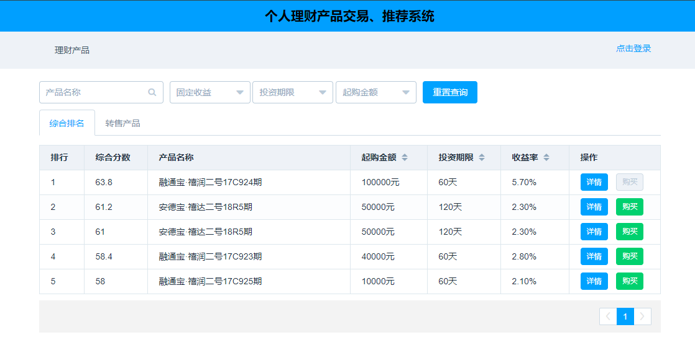
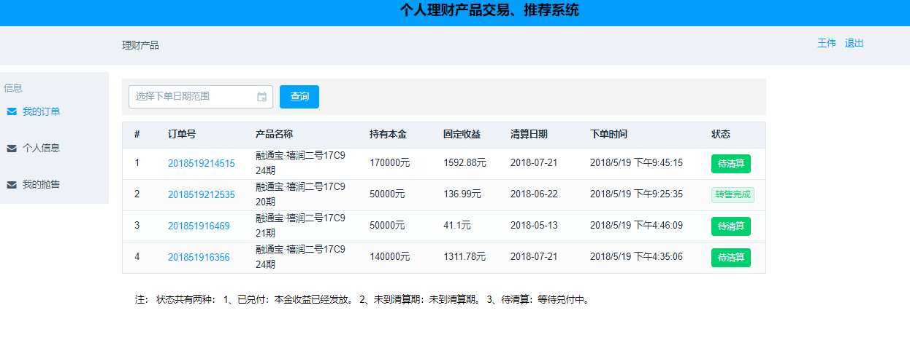
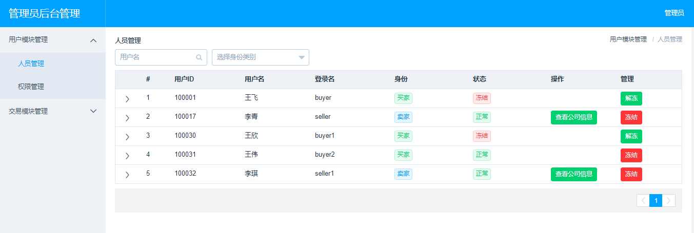
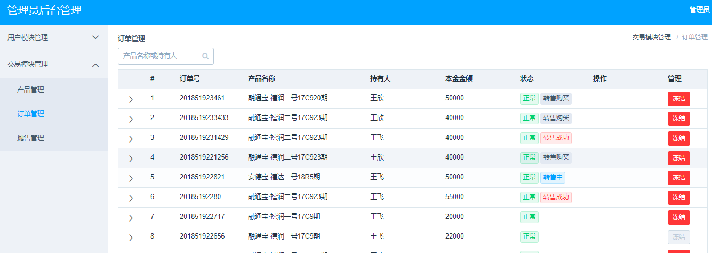
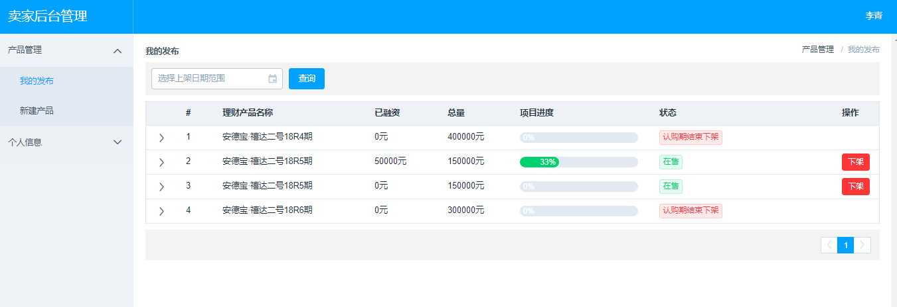

# trading-system
使用**vue+element+express+mysql**实现一个简单交易系统,该系统拥有**买家系统、卖家系统、管理员系统**，模拟实现卖家上线商品、管理员审核商品，管理商品和用户、买家进行购买商品，系统自动的计算理财产品的收益和更新理财产品的状态。对于产品的推荐，由于能力有限，只是做了一些根据产品的信息计算得分，之后进行简单的排名显示给买家。由于时间仓促开发的不全面，只能作为一个学习的练手项目，可以学习一下vue、element和expres服务器。

### 项目说明
这个项目是我本科期间的毕业设计，刚开始的题目是**个人理财产品的推荐交易系统**，但是由于需求分析不明确，就写成了一个通用的交易系统的平台。关于推荐的话本来是想结合机器学习什么的，但是写到最后发现太过复杂和拖延症就不了了之。现在这个项目主要功能交易平台的实现。功能有 **卖家系统+买家系统+管理员系统**。 支持注册和登录，其中管理员可以管理所有的用户的理财产品，卖家进行上线产品，买家进行购买产品。 
关于理财产品，可以简单的看成一个产品，但是拥有很多的属性，而且系统还需要每天根据其属性进行更新产品状态，根据收益公式计算买家收益。例如到了产品的清算日，系统就需要发放收益，进行卖家和买家的资金交换。这里采用的是用数据库事件（event）来进行自动的操作：每天凌晨自动的遍历所有产品，如果产品到期，则自动更新产品的状态,用户财产订单状态，用户每次访问自己的财产界面是都会自动的计算收益。为了实现这个功能只能对理财产品打各种的标签，致使数据库表比较臃肿，可以重新优化一下。系统也支持买家对理财产品进行转售，实现的方式就是将买家的订单打上标签，将其进入转售模块。这又导致数据库表比较臃肿，因为需要判定有没有到清算期，需要进行收益的二次分配，又是各种的标签。

### 界面展示
###### 1.主界面

###### 2.买家界面

###### 3.管理员和卖家登录界面

###### 4.管理员界面

###### 5.管理订单

###### 6.卖家界面

### 快速开始说明
0. 开发环境为node v6.2.0版本，mysql服务器>=5.6版本。
1. 找到server/数据导入文件/sqldata.sql文件，该文件可以直接的将数据导入到mysql数据库中。推荐使用heidisql客户端进行数据导入。同时更改/server/db.js文件，将其指向自己的的数据库。  
2. 从根目录进入server目录下安装express服务器依赖，打开cmd输入 npm install express mysql body-parser 等待安装完成。   
3. 在根目录,打开cmd命令窗口，输入cnpm install安装前端开发依赖。  
4. 开启服务进行测试。  
> * 开启后台服务器：在server目录下打开cmd 输入node index 显示正在监听3030端口  
> * 开启前端服务器：在根目录下打开cmd 输入 npm run dev 等待编译完成  

5. 可正常使用本系统。  

### 前端主要目录说明
0. 刚开始看这个项目肯定会比较乱，推荐从/src/routes.js 目录入手，这个文件里面包含了系统所有的路由，从这里可以看到整个项目的结构。   
1. /config：主要的配置文件，配置指向后台服务器也在此  
2. /src：主要的开发文件，自己所写的代码主要在这里面，由于这个项目是在别人开源的基础上进行开发的，所以有些的文件由于当时不是很清楚所以导致当初没有删掉，怕项目崩..有些文件是没有用的，只需要看主要部分就行。  
>* /src/views 主要的导航目录。   
>* ndex.vue 系统的主页面，理财产品推荐显示界面，买家登录界面  
>* main.vue 后台管理系统的主页面  
>* login.vue 卖家和管理员登录界面  
>* /src/componets 一些控件。  

3. main.js 整个vue项目的入口文件。  
4. server目录，服务器目录  

### 服务器主目录说明/server
1. /数据导文件 保存导入mysql数据库数据的文件  
2. /api/userApi.js  api文件，和前端交互的ajax处理文件，所有前端访问的ajax接口都是在这里设置。  
3. /public  服务器主目录，直接访问服务器时根目录就是此，开发完成后编译的文件直接发在此处就可以直接的访问。  
4. /db.js 配置服务器连接mysql数据库  
5. /index.js express服务器主配置文件  
6. /sqlMap.js 保存所有的sql语句。   

### 特别说明
因为前端使用的webpack打包工具，所以在更新代码的时候会自动的编译，但是服务器不能自动的更新，所以每次更改服务器代码时必须重启服务器。  
因为本系统只是一个简单的demo，不具备安全控制，也没有用到session，由于开发仓促还有很多的不足之处，但是可以作为一个学习vue的小项目，对于学习全栈的开发还是很有帮助的。未完待续。。  
最后，其实写毕设其实没必要写这么多，我答辩的时候老师就看了一个主页面不到五分钟就结束了...  